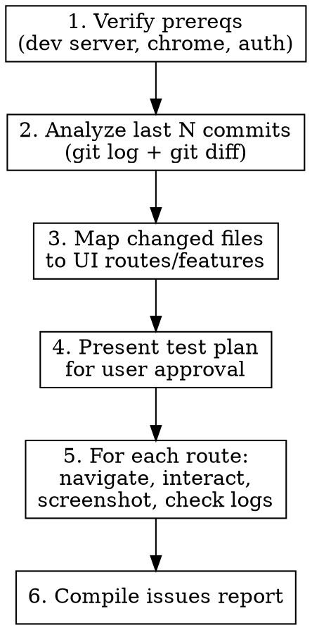

# E2E Visual Audit

Analyze the last N git commits, map changed files to UI routes, then use Chrome DevTools MCP to navigate each affected route, interact with changed features, take screenshots, check console logs and network requests, and produce a structured issues report.

Works with any web project (React, Svelte, Next.js, Vue, etc).

## Prerequisites

- Dev server running (user must confirm URL, e.g. `localhost:5173`, `localhost:3000`)
- Chrome open with DevTools MCP connected
- User is logged in / app is in testable state

If any prerequisite is missing, tell the user and stop. Ask for the dev server URL if not obvious from the project.

## Workflow



## Step 1: Verify Prerequisites

1. Run `list_pages` to confirm Chrome DevTools MCP is connected
2. Ask the user for the dev server URL if not obvious from the project config (check `package.json` scripts, vite config, next config, etc.)
3. Navigate to the dev server URL
4. Take a snapshot to verify the page loads
5. If the app requires auth, verify the user is logged in by checking the snapshot content
6. If any check fails, report what's missing and STOP

## Step 2: Analyze Recent Commits

```bash
# Get commit summaries (default N=5, user can override: /e2e-audit 3)
git log --oneline -N

# Get all changed files across those commits
git diff --name-only HEAD~N..HEAD

# Get detailed diff for understanding what changed
git diff --stat HEAD~N..HEAD
```

Read the project structure (check for `src/routes/`, `src/pages/`, `app/`, `pages/` etc.) to understand the framework's routing convention.

Categorize each changed file:
- **Route/page files**: Direct UI pages to test (framework-dependent path)
- **Component files**: Find which routes use them (grep for imports)
- **Service/state/store files**: Determine UI impact via component imports
- **API routes**: Test via UI features that call them
- **Style/config files**: Visual regression candidates

## Step 3: Map Files to Testable Routes

**This step is framework-aware.** Detect the framework and apply its routing convention:

| Framework | Route directory | URL mapping |
|---|---|---|
| SvelteKit | `src/routes/` | Directory = URL path, `+page.svelte` = page |
| Next.js (app) | `app/` or `src/app/` | Directory = URL path, `page.tsx` = page |
| Next.js (pages) | `pages/` or `src/pages/` | File = URL path |
| Nuxt | `pages/` | File = URL path |
| React Router | Check route config | Read router setup file |
| Vue Router | Check route config | Read router setup file |
| Plain/Other | Ask user | User provides URL mapping |

**For component files not directly in routes:**
1. Grep for the component name in route/page files to find which pages use it
2. If used in multiple routes, pick 2-3 most representative ones
3. If a shared/primitive component (button, input, etc.), test on the most complex page that uses it

**For dynamic route segments** (e.g., `[id]`, `[slug]`, `{param}`):
- Navigate to the app first, then extract real parameter values from the UI (sidebar links, lists, etc.)
- Or ask the user for a representative URL

**Present the route map to the user** before proceeding. Ask if any routes are missing or should be skipped.

## Step 4: Build and Present Test Plan

For each affected route, create a test plan:

```
Route: /some/route
Changed: ComponentName.svelte (or .tsx, .vue)
What changed: [brief description from diff]
Tests:
  1. Navigate to route
  2. Screenshot: initial load state
  3. Check console for errors/warnings
  4. Check network for failed requests
  5. Interact: [specific interactions based on what changed]
  6. Screenshot: after interaction
  7. Re-check console and network
```

**Present the full test plan to the user.** Ask if they want to add, modify, or skip anything before execution.

## Step 5: Set Up Screenshot Directory

Before executing tests, create an organized screenshot folder:

```bash
# Timestamped run folder so audits don't overwrite each other
mkdir -p ./test-output/e2e-audit/{YYYY-MM-DD_HH-MM}/

# Inside the run folder, create a subfolder per route:
# ./test-output/e2e-audit/2026-03-04_14-30/
# ├── instant-agent/
# │   ├── 01-initial-load.png
# │   ├── 02-after-send-message.png
# │   ├── 03-tablet-768px.png
# │   └── 04-mobile-375px.png
# ├── playbook/
# │   ├── 01-initial-load.png
# │   └── 02-after-drag-node.png
# ├── _issues/                    ← screenshots of specific issues
# │   ├── instant-agent--console-error-null-ref.png
# │   └── playbook--overflow-clipping.png
# └── REPORT.md
```

**Naming conventions:**
- Run folder: `{YYYY-MM-DD_HH-MM}` (date + time of audit start)
- Route subfolders: slugified route name (e.g., `instant-agent`, `design-system-brand-book`)
- Screenshot files: `{NN}-{descriptive-name}.png` — zero-padded sequence number + what it shows
- Issues folder: `_issues/` with `{route}--{issue-description}.png`

Set a variable for the run path and use it throughout:
```
RUN_DIR="./test-output/e2e-audit/{YYYY-MM-DD_HH-MM}"
```

## Step 6: Execute Tests

For EACH route in the approved plan:

### 6a. Navigate and Screenshot
```
mkdir -p {RUN_DIR}/{route-slug}/
navigate_page(url: "{devServerUrl}/{route}")
take_screenshot(filePath: "{RUN_DIR}/{route-slug}/01-initial-load.png", fullPage: true)
take_snapshot()  # a11y tree for interaction targets
```

### 6b. Check Console
```
list_console_messages(types: ["error", "warn"])
```
Record errors and warnings. Distinguish framework dev-mode warnings from genuine issues.

If a notable error is found, take a targeted screenshot:
```
take_screenshot(filePath: "{RUN_DIR}/_issues/{route-slug}--{error-description}.png")
```

### 6c. Check Network
```
list_network_requests(resourceTypes: ["xhr", "fetch"])
```
Look for: failed requests (4xx/5xx), unexpectedly slow requests, wrong endpoints.

### 6d. Interact with Changed Features

Based on what the diff shows changed:
- **New/modified buttons**: Click them via `click(uid)`, verify response
- **Forms**: Fill with test data via `fill_form`, submit, check result
- **Lists/tables**: Verify data renders, try sorting/filtering
- **Modals/dialogs**: Open and close them
- **Navigation changes**: Click links, verify routing
- **Text/content changes**: Verify correct text appears in snapshot

After each significant interaction, increment the screenshot counter:
```
take_screenshot(filePath: "{RUN_DIR}/{route-slug}/02-after-{action}.png")
list_console_messages(types: ["error", "warn"])
```

### 6e. Responsive Check (if layout/style changes detected)
```
resize_page(width: 768, height: 1024)   # Tablet
take_screenshot(filePath: "{RUN_DIR}/{route-slug}/{NN}-tablet-768px.png")
resize_page(width: 375, height: 812)    # Mobile
take_screenshot(filePath: "{RUN_DIR}/{route-slug}/{NN}-mobile-375px.png")
resize_page(width: 1440, height: 900)   # Restore desktop
```

## Step 7: Compile Report

Create `{RUN_DIR}/REPORT.md` and present it in chat.

**All screenshot paths in the report MUST be relative to the run directory** so the user can click through from the report file.

```markdown
# E2E Visual Audit Report
Date: {date}
Project: {project name from package.json}
Commits analyzed: {hash1}..{hash2} ({N} commits)
Dev server: {url}
Screenshots: ./{run-folder-name}/

## Summary
- Routes tested: X
- Screenshots taken: Y
- Issues found: Z (Critical: A, Warning: B, Info: C)

## Screenshot Index

| Route | File | Description |
|-------|------|-------------|
| instant-agent | [01-initial-load.png](./instant-agent/01-initial-load.png) | Page load state |
| instant-agent | [02-after-send-message.png](./instant-agent/02-after-send-message.png) | After sending chat message |
| ... | ... | ... |

## Issues

### CRITICAL
> Broken functionality, JS errors, crashed pages

#### [Issue title]
- **Route**: /path/to/route
- **Screenshot**: [filename.png](./route-slug/filename.png)
- **Issue screenshot**: [issue-name.png](./_issues/issue-name.png)
- **Console error**: `error message`
- **Commit**: abc1234 - "commit message"
- **Changed file**: path/to/file

### WARNING
> Visual regressions, UX problems, suspicious behavior

### INFO
> Minor observations, non-blocking

## Routes Tested

### /path/to/route
- Status: PASS / FAIL
- Screenshots: [list with relative links]
- Console errors: [count]
- Network failures: [count]
- Notes: [observations]

## Console Log Summary
[All errors/warnings grouped by route]

## Network Summary
[Failed requests grouped by route]
```

## Issue Classification

| Severity | Criteria |
|----------|----------|
| **CRITICAL** | JS errors in console, broken rendering (blank/crashed page), 500 network errors, missing critical UI elements, uncaught exceptions |
| **WARNING** | Visual misalignment, overflow/clipping, slow requests (>3s), deprecation warnings, elements not responding to interaction, layout shifts |
| **INFO** | Minor spacing, dev-mode console logs, cosmetic observations, slow but successful loads |

## Important Rules

- **NEVER modify any code** during the audit. This is read-only testing.
- **Always present the test plan** before executing. User approves what gets tested.
- If a route requires specific data/state (e.g., an existing record), note it as "requires setup" rather than skipping or failing.
- If Chrome crashes or MCP disconnects mid-audit, report what was completed and what remains.
- Use `fullPage: true` for layout-heavy pages to catch overflow issues.
- Compare what the diff says SHOULD have changed with what you actually see — flag mismatches.

### Screenshot Rules
- **Every screenshot goes to the `{RUN_DIR}` folder** — never save screenshots elsewhere.
- **Create the run directory with `mkdir -p`** at the start, including all route subfolders.
- **Use `fullPage: true`** by default. Only use viewport screenshots for specific element checks.
- **Sequentially number screenshots** within each route folder (`01-`, `02-`, `03-`...) so they sort chronologically.
- **Issue screenshots go in `_issues/`** with the route name prefix so they're traceable.
- **Use descriptive filenames** — `02-after-click-submit-btn.png`, not `02-action.png`.
- **Include the screenshot index table** in the report so the user can browse all captures at a glance.
- At the end, tell the user: `open ./test-output/e2e-audit/{run-folder}` to browse all screenshots.
